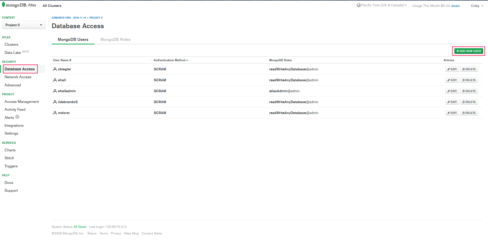

# Project Bojack
Project Bojack is an online application with intention of being used to track the condition of and 
work done on horses by employees of `The Ferrier Center`.

## Installing Dependencies

Our project depends on several node packages, which are specified in `package.json`. To install all
dependencies, run `npm install` (or `npm i` for short).

Any time you pull code from GitLab, you should run `npm install` again if any new packages have been
added to `package.json`. All packages will be "installed" in `node_modules`, so if you think there's
something wrong with an installed package, you can simply delete that folder and run `npm install`
again. (Some versions of `npm` support the `npm clean-install` command, which will do this for you).

## MongoDB Setup
To Interface with the database first you must create an account on the cluster, to do this 
1. Go to https://cloud.mongodb.com and login.
2. Click on the cluster.
3. Under the Security header click on `Database Access`.
4. Click on `ADD NEW USER`. 
5. Create your account for the database, You should only need the read and write permissions. 

**It is recommended not to use special characters.**



To get your IDE to connect properly with the cluster you must either find or make a `.env` file in 
the root directory of the project and then configure the following two _environment variables_:

```
MONGO_USER='username'
MONGO_PASS='password'
```

Change `'username'` and `'password'` to your actual MongoDB username and password.

## Configure Port

In `.env`, you can specify the desired port number, e.g.:

```
PORT=80
```
